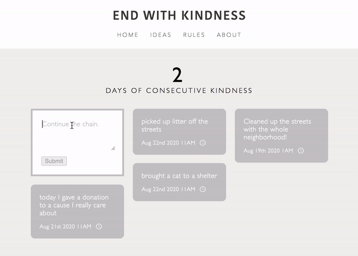
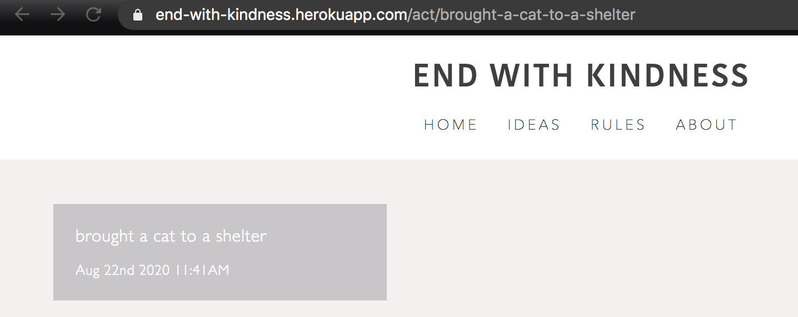

   

# End With Kindness
An anonymous posting board site for acts of kindness. Built with MongoDB, Express, React, Node.js (MERN).

Application is live [here](https://end-with-kindness.herokuapp.com/). 

## Table of Contents
* [Key Features](#key-features)
* [Built with](#built-with)
* [Challenges](#challenges)
* [Project Status](#project-status)

## Key Features
* Post an act of kindness  

* Global tracker that keeps track of consecutive days of postings  

* Link to a specific post  

## Built with
* [Express](https://expressjs.com/) - Web application framework for Node.js
* [MongoDB](https://www.mongodb.com/) - NoSQL Database
* [React](https://reactjs.org) - JavaScript library for building user interfaces

## Challenges

## Project Status
This project is currently finished.

